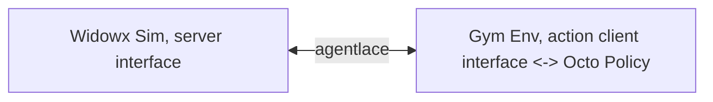
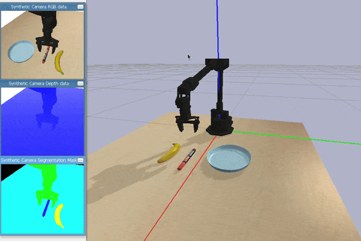
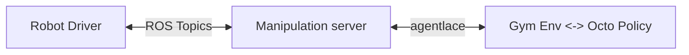

# Manipulator Gym

> ⚠️ Still in early development, expect breaking changes ⚠️

This package provides a common gym-like environment for policy to interact with a manipulator robot. The environment is based on the `gym` interface, and the robots are defined as `interfaces`. The abstracted robot interfaces is easily swappable, modularized and run distributedly. Common utilities are provided to assist users to run robot policies (e.g. octo) on the robot.

| Manipulator Interfaces                                              | Description                                           |
| ------------------------------------------------------------------- | ----------------------------------------------------- |
| [widowx](./manipulator_gym/interfaces/widowx.py)                    | Interbotix widowx interface in ROS1                   |
| [widowx_ros2](./manipulator_gym/interfaces/widowx_ros2.py)          | Interbotix widowx interface in ROS2                   |
| [widowx_sim](./manipulator_gym/interfaces/widowx_sim.py)            | Interbotix widowx in a pybullet sim                   |
| [viperx](./manipulator_gym/interfaces/viperx.py)                    | Interbotix viperx interface in ROS1                   |
| [service_client](./manipulator_gym/interfaces/interface_service.py) | client interface to connect a remote interface server |

*more coming soon.... (etc. mujoco panda)*

**Other useful features are also provided**
- Eval script to run a robot policy [octo](https://octo-models.github.io/)
- VR data collection script to collect data for RLDS training (also support remote data collection)
- Fine-tuning script to finetune the octo model with the collected RLDS data


## Installations:

- [pybullet](https://pypi.org/project/pybullet/): used in `widowx_sim`.
- [octo](https://octo-models.github.io/): for the generalist robot policy
- [agentlace](https://github.com/youliangtan/agentlace): for distributed robot agent interfaces
- [oxe_envlogger](https://github.com/rail-berkeley/oxe_envlogger): for logging the data in RLDS format


## Quick Start

### Code Snippets

To use the gym env, is quite straightforward. Define it as such:
  
```python
from manipulator_gym.manipulator_env import ManipulatorEnv
from manipulator_gym.interfaces.base_interface import ManipulatorInterface

# 1. define select the robot interface
# ManipulatorInterface is an abstract class, you choose the interfaces from the list above
# e.g. interface = WidowXSimInterface(), ViperXInterface(), etc.
interface = ManipulatorInterface()

# 2. define the gym env, Done!
env = ManipulatorEnv(interface=interface)
```

Then, you can use the gym env as you would with any other gym env. :partying_face: You can also use other `interfaces` to run different kinds of manipulators, e.g. `widowx`, `viperx`, `action_client-server`, etc.


Alos, we can make the interface to be a server-client setup, to run the policy on a different process, or even machine. Create 2 seperate scripts `server.py` and `client.py`:

1. In `server.py`. Run the interface as server

```python
from manipulator_gym.interfaces.base_interface import ManipulatorInterface
from manipulator_gym.interfaces.interface_service import ManipulatorInterfaceServer

server = ManipulatorInterfaceServer(manipulator_interface=interface)
server.start()
```

2. In `client.py`. Then run the env with the client interface

```python
from manipulator_gym.manipulator_env import ManipulatorEnv
from manipulator_gym.interfaces.interface_service import ActionClientInterface

interface = ActionClientInterface(host=FLAGS.ip)
env = ManipulatorEnv(manipulator_interface=interface)
```

Tada!

### Run Examples

First, we show how to run a simple sim env of a widowx robot, while enabling logging of rlds data.

```bash
# This runs a sim env of the manipulator
# To logs the data in RLDS format, add: --log_dir log_dir/   (requires oxe_envlogger)
python manipulator_gym/manipulator_env.py --widowx_sim
```

To visualize logged data
```bash
python read_rlds.py --show_img --rlds_dir log_dir/
```

Also, we can run the octo model to evaluate the robot policy on the robot. This requires the octo model to be installed. Showcase a distributed "robot server" and "policy client" setup

Run the "Robot Server"
```bash
python manipulator_server.py --widowx_sim
```

Run Teleoperation to collect control the robot
```bash
python manipulator_teleop.py # --ip IP
```

**Provide `--use_spacemouse` to use the [spacemouse](https://github.com/JakubAndrysek/pyspacemouse) for teleoperation


Run the "Policy Client":
```bash
# --text_cond is the task condition, e.g. "put the red marker on the table"
python octo_eval.py --ip IP_ADDRESS --show_img --text_cond "put the banana on the plate"
```

Communication nodes looks like this:



<p align="center">
  
</p>

☝️ This is what you expect to see when running the above commands.


---

## Interfaces

### WidowX Sim

This uses the pybullet sim to simulate the widowx robot.

```bash
pip install pybullet
```

### ViperX or WidowX

This requires user to download the respective dependencies for the robot, and run the robot interface.

**Install the interbotix_ros_arms package**
for the viper/widowx robot for follow the docs from trossen roboitcs:
 - ros: [link](https://docs.trossenrobotics.com/interbotix_xsarms_docs/ros_interface/ros1/software_setup.html)
 - ros2: [link](https://docs.trossenrobotics.com/interbotix_xsarms_docs/ros_interface/ros2/software_setup.html)

Now, it is time to run the policy on the real robot. To enable this, we use the following architecture to abstract out the robot env with the policy. This is enabled by [agentlace](https://github.com/youliangtan/agentlace).



1. Run the robot driver (ROS2 example)
```bash
# ros1: roslaunch interbotix_xsarm_control xsarm_control.launch robot_model:=wx250
# ros2 example:
ros2 launch interbotix_xsarm_control xsarm_control.launch.py robot_model:=wx250s
```

2. Run the widowx/viperx server interface
```bash
# choose viperx 
python manipulator_server.py --widowx_ros2
```

3. Run the octo model on a different machine
```bash
python octo_eval.py --ip IP_ADDRESS --show_img --text_cond "PROVIDE YOUR TEXT TASK"
```

---

## Finetuning pipeline

Data collection and Fine-tuning of Octo model

Generate the log files for the RLDS training, this example uses `test_vrmani_env` dataset.
```bash
# use --test for testing mode, in actual use case with oculus controller
python3 vr_data_collection.py --rlds_output . --test
```
*Note: need to [oculus_reader](https://github.com/rail-berkeley/oculus_reader) to collect data with occulus vr controller (linear movement with controller, rotation with controller joystick)*

(optional) Validate the generated log files by replaying on the robot gym env
```bash
python3 read_rlds.py --show_img --rlds_dir PATH_TO_LOGS  --replay 
```

Now finetune the model using the generated log files
```bash
cd octo
python scripts/finetune.py --config=../manipulator_gym/viperx_finetune_config.py --config.pretrained_path=hf://rail-berkeley/octo-small
```

---

## Others

- If you wish to directly wrap the gym env for distributed gym inference, you can directly use agentlace's [action env wrapper](https://github.com/youliangtan/agentlace/blob/main/examples/action_cartpole_env.py)
- TODO: create util scripts for wandb eval loggings
- TODO: better interfaces with extend-able sensors and actuators (e.g. camera, bimanual manipulators, etc.)


## Notes

This is still in active development. Open issues for wishlist and bugs.
