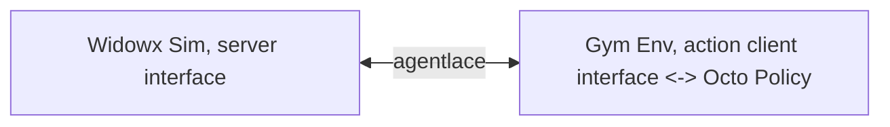
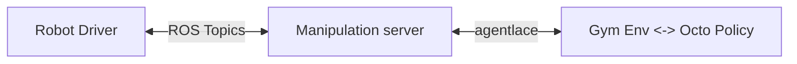

# Manipulator Gym


> ⚠️ Still in early development, expect breaking changes ⚠️

This package provides a common gym-like environment for policy to interact with a manipulator robot. The environment is based on the `gym` interface, and the robots are defined as `interfaces`. The abstracted robot interfaces is easily swappable, modularized and run distributedly. Common utilities are provided to assist users to run robot policies (e.g. octo) on the robot.

| Manipulator Interfaces                                              | Description                                           |
| ------------------------------------------------------------------- | ----------------------------------------------------- |
| [widowx](./manipulator_gym/interfaces/widowx.py)                    | Interbotix widowx interface in ROS1                   |
| [widowx_ros2](./manipulator_gym/interfaces/widowx_ros2.py)          | Interbotix widowx interface in ROS2                   |
| [widowx_sim](./manipulator_gym/interfaces/widowx_sim.py)            | Interbotix widowx in a pybullet sim                   |
| [viperx](./manipulator_gym/interfaces/viperx.py)                    | Interbotix viperx interface in ROS1                   |
| [service_client](./manipulator_gym/interfaces/interface_service.py) | client interface to connect a remote interface server |

*more coming soon.... (etc. mujoco panda)*

**Other useful features are also provided**
- Eval script to run a robot policy [octo](https://octo-models.github.io/) and [openvla](https://openvla.github.io/)
- Data collection script to collect data for RLDS training (also support remote data collection)
- Fine-tuning script to finetune the robot policy with the collected RLDS data

## Installations:

- [agentlace](https://github.com/youliangtan/agentlace): for distributed robot agent interfaces
- [pybullet](https://pypi.org/project/pybullet/): used in `widowx_sim`. (Optional)
- [oxe_envlogger](https://github.com/rail-berkeley/oxe_envlogger): for logging the data in RLDS format (Optional)
- Robot Policies (Optional):
  - [octo](https://octo-models.github.io/)
  - [openvla](https://openvla.github.io/)

## Quick Start

### Code Snippets

To use the gym env, is quite straightforward. Define it as such:
  
```python
from manipulator_gym.manipulator_env import ManipulatorEnv
from manipulator_gym.interfaces.base_interface import ManipulatorInterface

# 1. define select the robot interface
# ManipulatorInterface is an abstract class, you choose the interfaces from the list above
# e.g. interface = WidowXSimInterface(), ViperXInterface(), etc.
interface = ManipulatorInterface()

# 2. define the gym env, Done!
env = ManipulatorEnv(interface=interface)

# 3. Use the 'env' as standard gym env. E.g.: env.reset(), env.step(), etc.
```

Then, you can use the gym env as you would with any other gym env. :partying_face: You can also use other `interfaces` to run different kinds of manipulators, e.g. `widowx`, `viperx`, `action_client-server`, etc.


Also, we can make the interface to be a server-client setup, to run the policy on a different process, or even machine. Create 2 seperate scripts `server.py` and `client.py`:

1. In `server.py`. Run the interface as server

```python
from manipulator_gym.interfaces.base_interface import ManipulatorInterface
from manipulator_gym.interfaces.interface_service import ManipulatorInterfaceServer

server = ManipulatorInterfaceServer(manipulator_interface=interface)
server.start()
```

2. In `client.py`. Then run the env with the client interface

```python
from manipulator_gym.manipulator_env import ManipulatorEnv
from manipulator_gym.interfaces.interface_service import ActionClientInterface

interface = ActionClientInterface(host=FLAGS.ip)
env = ManipulatorEnv(manipulator_interface=interface)

# Use the 'env' as standard gym env. E.g.: env.reset(), env.step(), etc.
```

Tada!

## Run Examples


### 1. Run a scripted rollout on the robot

How to run a simple sim env of a widowx robot, while enabling logging of rlds data.

```bash
# This runs a sim env of the manipulator
# To logs the data in RLDS format, add: --log_dir log_dir/   (requires oxe_envlogger)
python manipulator_gym/manipulator_env.py --widowx_sim
```

To visualize logged data
```bash
python read_rlds.py --show_img --rlds_dir log_dir/
```


### 2. Robot Teleoperation

Run the "Robot Server" with a simulated widowx robot.
```bash
python manipulator_server.py --widowx_sim
```

Run Teleoperation script (action client) to control the robot with keyboard. Provide IP for remote teleoperation.
```bash
python teleop.py # --ip IP
```

**Provide `--use_spacemouse` to use the [spacemouse](https://github.com/JakubAndrysek/pyspacemouse) for teleoperation

### 3. Run a Robot policy

Now, we will replace the `teleop.py` with a robot policy. 

Run the "Robot Server"
```bash
python manipulator_server.py --widowx_sim
```

Run the "Policy Client":

We provide 2 example generalist policies to evaluate a manipulation task with text conditioning:
 - **Octo**: [octo](https://octo-models.github.io/)
  ```bash
  # --text_cond is the task condition, e.g. "put the red marker on the table"
  python policies/octo_eval.py --ip IP_ADDRESS --show_img --text_cond "put the banana on the plate"
  ```

 - **OpenVLA**: [openvla](https://openvla.github.io/)
  ```bash
  # --text_cond is the task condition, e.g. "put the red marker on the table"
  python policies/vla_eval.py --ip IP_ADDRESS --show_img --text_cond "put the banana on the plate"
  ```

Communication nodes looks like this:



<p align="center">
  
</p>

☝️ This is what you expect to see when running the above commands.

However, you would expect that the generalist policy would not work well in the simulation environment as it is not trained on the simulation data. 

---

## Interfaces

### WidowX Sim

This uses the pybullet sim to simulate the widowx robot.

```bash
pip install pybullet
```

### ViperX or WidowX

This requires user to download the respective dependencies for the robot, and run the robot interface.

**Install the interbotix_ros_arms package**
for the viper/widowx robot for follow the docs from trossen roboitcs:
 - ros: [link](https://docs.trossenrobotics.com/interbotix_xsarms_docs/ros_interface/ros1/software_setup.html)
 - ros2: [link](https://docs.trossenrobotics.com/interbotix_xsarms_docs/ros_interface/ros2/software_setup.html)

Now, it is time to run the policy on the real robot. To enable this, we use the following architecture to abstract out the robot env with the policy. This is enabled by [agentlace](https://github.com/youliangtan/agentlace).



1. Run the robot driver (Note the ros1 and ros2 launch commands)
```bash
# ros1:
roslaunch interbotix_xsarm_control xsarm_control.launch robot_model:=wx250s use_rviz:=false
# ros2 example:
ros2 launch interbotix_xsarm_control xsarm_control.launch.py robot_model:=wx250s
```

2. Run the widowx/viperx server interface
```bash
# choose viperx 

# ros1 [cam_ids is the USB camera id]
python3 manipulator_server.py --widowx --cam_ids 0

# ros2 [cam_ids is the USB camera id]
python manipulator_server.py --widowx_ros2 --cam_ids 0
```

3. Run the octo model on a different machine
```bash
python policies/octo_eval.py --ip IP_ADDRESS --show_img --text_cond "PROVIDE YOUR TEXT TASK"
```

---

## Finetuning pipeline

Data collection and Fine-tuning of Octo model

Collect expert demonstations via teleop.
```bash
# Usage
# --log_dir to log the data in RLDS format, requires oxe_envlogger
# --reset_pose <x y z r p y gripper> to reset the robot to a specific pose
# --log_lang_text is an optional str to provide a text for language conditioned task
python manipulator_gym/teleop.py --ip <IP_ADDRESS> --log_dir <LOG_DIR> --log_lang_text "pick up the something to something"
```

Data is saved as a trajectory per shard. When click on `r`, this will reset the robot and start a new trajectory. When click on `q`, this will stop the teleop and save the data.


(optional) Validate the generated log files by replaying on the robot gym env
```bash
python3 read_rlds.py --show_img --rlds_dir PATH_TO_LOGS  --replay 
```

### Octo Finetuning

Now finetune the model using the generated log files
```bash
cd octo
python scripts/finetune.py --config=../manipulator_gym/viperx_finetune_config.py --config.pretrained_path=hf://rail-berkeley/octo-small
```

Lastly,, evaluate the finetuned model with the same `octo_eval.py` script as above. (provide the new chkpt and dataset stats)

### OpenVLA Finetuning

We can also use the collected RLDS for OpenVLA finetuning, check out the doc in [openvla](https://github.com/openvla/openvla/) for more details. Reference to this PR: https://github.com/openvla/openvla/pull/86.

Create a such directory structure with the expert demos collected via `teleop.py`. The fine-tuned adapted checkpoints of VLA will be saved in `vla_storage/checkpoints`
```
~/vla_storage
 |_ checkpoints             # full merged model checkpoints
 |_ adapter_checkpoints     # adapter checkpoints
 |_ expert_demos
    |_ 0.1.0
       |_ dataset_info.json
       |_ features.json
       |_ expert_demos-train.tfrecord....
```

```bash
# we will use Single Node of 2 GPUs to finetune the model
# adjust the args accordingly
torchrun --standalone --nnodes 1 --nproc-per-node 2 vla-scripts/finetune.py --batch_size 4 --shuffle_buffer_size 10000 --lora_rank 32 \
--data_root_dir ~/vla_storage --dataset_name expert_demos --run_root_dir ~/vla_storage/checkpoints --adapter_tmp_dir  ~/vla_storage/adapter_checkpoints--use_quantization true --save_steps 1000 \
--wandb_project <PROJECT_NAME> --wandb_entity <YOUR_WANDB_ACCOUNT>
```

Evaluate the finetuned model
```bash
python policies/vla_eval.py --ip 128.32.175.45 --show_img --text_cond "move the eggplant from the basket to the center of the sink" --lora_adapter_dir <PATH_TO_ADAPTER_CHECKPOINT>
--dataset_stats <PATH_TO_DATASET_STATS>
```

---

## Others

## FAQ

1. Interbotix ROS Installation Error.

```sh
CMake Error at /opt/ros/noetic/share/catkin/cmake/empy.cmake:30 (message):
  Unable to find either executable 'empy' or Python module 'em'...  try
  installing the package 'python3-empy'
Call Stack (most recent call first):
  /opt/ros/noetic/share/catkin/cmake/all.cmake:164 (include)
  /opt/ros/noetic/share/catkin/cmake/catkinConfig.cmake:20 (include)
  CMakeLists.txt:58 (find_package)


-- Configuring incomplete, errors occurred!
See also "/home/pranav/interbotix_ws/build/CMakeFiles/CMakeOutput.log".
Invoking "cmake" failed
[ERROR] Failed to build Interbotix Arm ROS Packages.
[ERROR] Interbotix Installation Failed!
```

Make sure that you are not running the installation in a conda environment. If you are, deactivate the conda environment and run the installation again.

## Notes

- If you wish to directly wrap the gym env for distributed gym inference, you can directly use agentlace's [action env wrapper](https://github.com/youliangtan/agentlace/blob/main/examples/action_cartpole_env.py)
- If you wish to save the raw teleop data in pkl format, indicate `--log_type pkl` when running the `teleop.py` script
- This is still in active development. Open issues for wishlist and bugs.

 - In progress:
  - More interfaces (e.g. mujoco panda, franka, etc.)
  - More sim envs (e.g. robosuite etc.)
  - create util scripts for wandb eval loggings
  - better interfaces with extend-able sensors and actuators (e.g. camera, bimanual manipulators, etc.)
  - Cleaner impl of VR controller method with [oculus_reader](https://github.com/rail-berkeley/oculus_reader) to collect data with occulus vr controller (linear movement with controller, rotation with controller joystick)*
